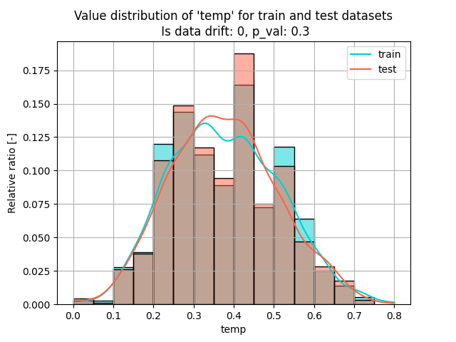

# Data-validation-scenario

There is a large boom of ML systems deployed to production these days. This
brings many demands to ML engineers. ML pipeline automation is possibly the most
important one. However, there is also one less known but very important aspect.
That is the validation of inputs and outputs of the ML system. In fact, data
validation is listed as one of
the [hidden technical debts](https://proceedings.neurips.cc/paper/2015/file/86df7dcfd896fcaf2674f757a2463eba-Paper.pdf)
in machine learning systems. There is a long history of projects that end up in
a disaster and that could be most likely saved by a proper data validation
process.

In this repository, we show how we may integrate data drift
detection ([alibi-detect](https://github.com/SeldonIO/alibi-detect) library)
with [DVC](https://dvc.org/) into the ML system and how is DVC beneficial in it.
We demonstrate the drift detection in one use case:

- Detection of covariate shift between train and test datasets.

We refer to an
excellent [Data Distribution Shifts and Monitoring post](https://huyenchip.com/2022/02/07/data-distribution-shifts-and-monitoring.html)
for a detailed overview and precise definition of covariate shift and concept
drift.

### Technical requirements

The core functionalities are comming from `dvc` and `alibi-detect`
(has `tensorflow` dependency) libraries.

The project is tested with Python 3.7 and higher.

### Instructions to run the project

1. Clone the repository
    ```commandline
    git clone https://gitlab.com/iterative.ai/cse/solutions/data-validation-scenario.git
    ```
2. Change folder
    ```commandline
    cd data-validation-scenario
    ```
3. Create virtual environment and activate it
    ```commandline
    python -m venv .venv
    source .venv/bin/activate
    ```
4. Activate the virtual environment and install all the required libraries
    ```commandline
    pip install -r requirements.txt
    ```
5. Now, you can run the pipeline with `dvc` commands.
    ```commandline
    dvc repro
    ```

## Description of the project

### Dataset

A dataset in the project is the same as the used in
the [Stale model blogpost](https://dvc.org/blog/stale-models), that is bike
sharing dataset you can either manually
download [online](https://archive.ics.uci.edu/ml/machine-learning-databases/00275/Bike-Sharing-Dataset.zip)
or you can let the pipeline download it for you.

The dataset covers bike sharing services for the years 2011-2012 aggregated on a
daily and hourly basis. We will focus on hourly basis aggregation. The detailed
description of the features is in the readme document in the dataset zip file.

### ML Model

The main focus of this project shall be a demonstration of drift detection,
therefore, we have decided to use a simple off-the-shelf ML model, without any
thought-out preprocessing steps. We acknowledge that performance of the ML model
could be better if we would pay more attention to these steps.

### Data drift detector

This project uses a popular
library [alibi-detect](https://docs.seldon.io/projects/alibi-detect/en/latest/overview/algorithms.html)
that comprises several powerful algorithms for the detection of both outliers
and data drift.

The dataset that we are using is a tabular dataset that consists of both
continuous numerical features and categorical features. Various drift detectors
handle this setting. We have decided to
use [The Maximum Mean Discrepancy (MMD)](https://docs.seldon.io/projects/alibi-detect/en/latest/cd/methods/mmddrift.html)
the detector as it is popular, easy to use and gives good results in our use
case.

### DVC pipeline

The `dvc.yaml` file is located in the root of the repository and consists
of the following stages:

- *data_preparation* - This stage downloads data if not already present and
  preprocesses them according to the configuration.
- *model_training* - This stage trains a simple RandomForrestClassifier model.
- *covariate_drift_detector_training* - This stage trains a covariate drift
  detector.
- *evaluation* - This stage evaluates the performance of the model and if there
  is a drift in the training/test dataset split.

## Scenarios

We demonstrate the drift detection on the following scenario.

### 1) Validation of training/test split

Let's imagine we have collected bike sharing data for two months (March and
April) and we would like to know a good strategy for splitting this data into
training and test datasets. There are many possibilities for how to achieve
that. Two intuitive strategies would be: a) use March data for training and
April data for testing, or, b) take both months and randomly split the data.

You can run this pipeline with

```bash
dvc repro
```

Below, you can see a graph that was generated by the pipeline. It is a
combination of two histogram plots
(for training and test data) of feature `temp`. On the horizontal axis is a
value of the `temp` feature. It ranges from 0 to 1 because it is normalized in
the dataset. On the vertical axis is a relative prevalence of the bin. This
prevalence is also normalized meaning that the sum of all bins for one dataset
is equal to 1.


